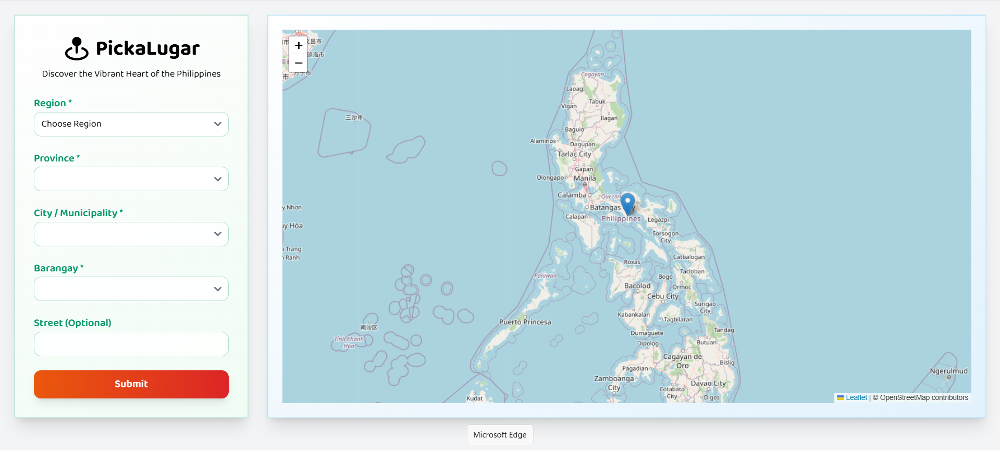

# PickaLugar-PH

Picka-Lugar-PH is a fun and user-friendly address selector built for the **Philippines**. It allows users to easily choose their **region**, **province**, **city/municipality**, and **barangay** through a dynamic dropdown that integrates mapping.

## 🔍 **PickaLugar-PH**

**Picka** = Playfully sounds like “Pick a” (choose a)  
**Lugar** = “Place” in Filipino/Spanish  
**PH** = Philippines 🇵🇭

So it could mean:  
👉 **"Pick a Place Philippines"** — fun, local, and easy to remember.

## 📸 Screenshot

# Location Selector - Philippines
### PH Location JSON file from [isaacdarcilla/philippine-addresses](https://github.com/isaacdarcilla/philippine-addresses)

